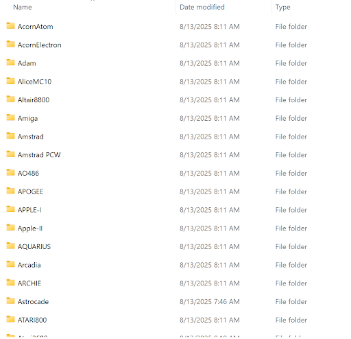
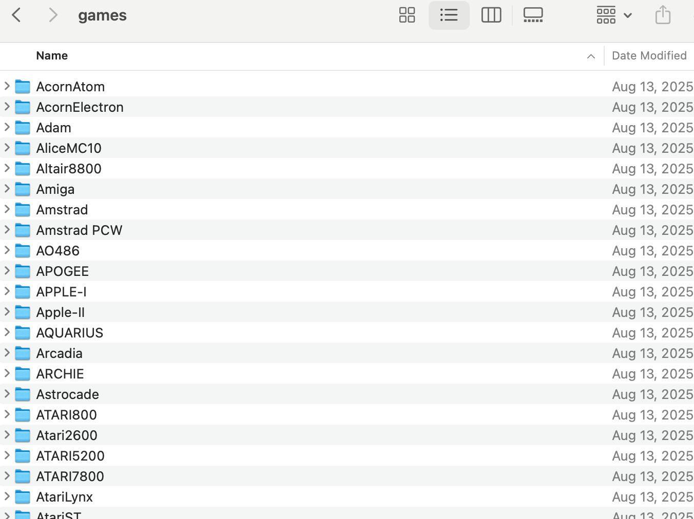
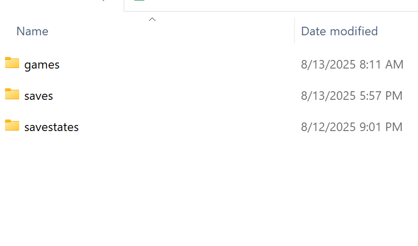
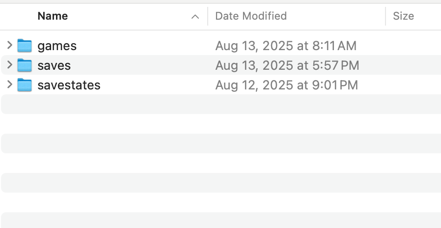

# Setting up a NAS for the MiSTer FPGA

Setting up a Network Attached Storage (NAS) device is a great way to share your gaming library amongst multiple MiSTer FPGA’s (or computers), or if you want an easier way of updating your game library without having to turn on your MiSTer FPGA.

There are tons of ways of doing this. You can configure your own computer to do this. Purchase prebuilt devices like a Synology or build your own dedicated NAS. The solution I went with is the DIY method using a Raspberry Pi. Pi’s are affordable, readily available and very well documented so they provide an accessible way of having your own dedicated NAS.

The software I’ll be using is Open Media Vault. It’s very popular in the Raspberry Pi community and even offers the ability to use docker containers to allow other services to run. I decided not to use Retro NAS because I have a different project in mind for that. I want to use Retro NAS for a retro PC network, but that requires running some unsecure protocols, so I need to create an isolated network.

Below is a written guide to setting everything up. I also have a video that walks you through the process too.

Overview video: https://youtu.be/8Hi5eiHuaSU

Detailed guide video: https://youtu.be/WqWFAfisbeU

# Requirements

1. At least a Raspberry Pi 2. Newer ones will give you better performance
    * Raspberry Pi OS Lite installed on the Pi
2. An empty USB drive to use as storage for your games. We will be erasing all data on it.
3. On the MiSTer FPGA
    * Download the following scripts from GitHub
        * Download:[ https://github.com/MiSTer-devel/Scripts_MiSTer](https://github.com/MiSTer-devel/Scripts_MiSTer)
        * cifs_mount.sh
        * cifs_umount.sh
4. Raspberry Pi connected over ethernet.
    * Pi’s ethernet MAC address assigned a static IP address on your router. All routers are different so you will need to refer to your routers manual.

# Written Instructions

### **Install Raspberry Pi OS Lite**

Instructions here: [https://www.raspberrypi.com/documentation/computers/getting-started.html#raspberry-pi-imager](https://www.raspberrypi.com/documentation/computers/getting-started.html#raspberry-pi-imager)

### **Install Open Media Vault**

* Connect the Raspberry Pi to a monitor and keyboard and to your network over ethernet.
* Log into the Pi. Default username and password are
    * Username: pi
    * Password: raspberry
    * If you setup a different account use those credentials
* Follow the Pi My Life up instructions to Install Open Media Vault
    * Video Instructions: [https://www.youtube.com/watch?v=LxsowTcNmY4](https://www.youtube.com/watch?v=LxsowTcNmY4)
    * Written Instructions: [https://pimylifeup.com/raspberry-pi-openmediavault/](https://pimylifeup.com/raspberry-pi-openmediavault/)

### **Configuring Open Media Vault(OMW) - Password and Hostname**

Once Open Media Vault is installed, login to Open Media Vault’s web interface using a Web browser on a computer that is connected to your local network. Use the Pi’s IP address as the URL (e.g. http://&lt;ip_address>). By default there is no secure (https) connection. So use http and not https.

Default username and password

* Username: admin
* Password: openmediavault

If you want to change your password

* Click on “User Settings” icon at the top.
* Click “Change password”
* Set the new password and save

If you want to set a hostname so you don’t have to use an IP address. For example, typing in something like [http://games.local](http://games.local) to access the web interface.

* Setting a host name. (s)
    * Go to Network—>General
    * Change Hostname to what you want.
        * I personally used “games”
        * A domain name is required. Change it to what you want, I set it to “local”.
    * Click save
    * There will be a “Pending configuration changes” alert. Click on the check on the alert to apply changes.

### **Configuring Open Media Vault - Setting up Storage**

The USB storage you connected to the Raspberry Pi needs to be set up. To do that follow the below instructions.

* Erasing the drive
    * Storage —>Disks
    * Click on your USB drive.
    * Click erase button
    * Click confirm
    * Click Yes
    * Click Quick erase.
* Setup files system
    * Go to Storage —> File Systems
    * Click the “+” button
    * Choose “EXT4”
    * On Device select your drive
    * Click Save
    * When file system is setup click “Close”
    * You will then be in the mount section
        * Alternatively we can also get to the Mount section by:
            * Go to Storage —> File Systems
            * Click Play button
    * On File System dropdown select the file system you created
    * Click Save
    * On the Pending Configuration Alert click on the checkbox.

### **Configuring Open Media Vault - Setting up Shared Folders**

* Go to Storage—>Shared folders
* Click “+” button
* Enter name of storage
    * I’m calling it “games”
* Select your USB drives filesystem
* Set the Relative path if you want it different to what is automatically set. Else leave it alone
    * I leaving mine as “games”
* Set the type of permissions
    * I leave it as “Admin read/write; user:read/write, Others: read-only”
* Click save.
    * Click on the check box in the Pending changes alert
    * Now we see the shared folder

### **Configuring Open Media Vault - SMB Share**

We are going to be using SMB shares with the MiSTer FPGA. So the SMB protocol has to be enabled and new shares for SMB also need to be created.

* Enable SAMBA
    * Go to Services—> SMB/CIFS—>Settings
    * Check “Enabled”
    * Leave everything as is and scroll down and click “Save”
    * On the Pending Configuration Alert click on the checkbox
* To Create Samba Shares
    * Go to Services—> SMB/CIFS—>Shares
    * Click on “+” button
    * On the “Shaled folder” drop down, the previous “games” share i created will show up here. I Select it, but if you named your share differently select that.
    * Leave everything else as is.
    * Scroll down and click Save
    * Click on the check box in the Pending changes alert

### **Configuring Open Media Vault - Adding Users**

* Adding Users
    * Go to Users—>Users
    * If this is a new Raspberry Pi installation, there will be only one user and that will be the default “pi” account (Or a custom account if you went that route). We are going to create a separate account specifically for accessing games from the MiSTer FPGA.
    * Click “+”—> Create
    * For name: retro
    * Password: retro
        * You can use also any username and password you like
    * Save it
    * Click on the check box in the Pending changes alert

Now Open Media Vault is completely configured. We are ready to copy games onto the MiSTer FPGA.

### **Configuring Open Media Vault - Creating Folders on Storage**

There are two ways to set up the folders for a MiSTer FPGA to access. Make a decision between these two.

1. If you only plan on accessing games over the network. You do not want to access saves and save states.
2. You want to access games, saves and save states over the network. Be careful with this method. Another MiSTer user connected over the network can easily overwrite a save or save state.

I’ll be showing both ways, but let me first show you how to access the NAS storage from a Windows and Mac computer.

* Windows
    * Open any folder
    * On the URL box type
        * **\<pi_ip_address>** or **\<pi_hostname>**
        * In my case I would type this if I’m using the IP address
            * **\\192.168.0.51**
        * If I’m using the host name, I would type this
            * **\\games.local**
        * enter the new users credentials you created in OMW
            * I used the following credentials
                1. Username: retro
                2. Password: retro
* Mac OS.
    * On the desktop click on
    * Go Menu option at top—>Connect to Server
    * type: smb://192.168.0.51/
    * **smb://&lt;pi_ip_address>** or **smb://&lt;pi_hostname>**
        * In my case I would type this if I’m using the IP address
            * **smb://192.168.0.51**
        * If I’m using the host name, I would type this
            * **smb://games.local**
    * enter the new users credentials you created in openmediavault
        * my user was called “retro”

On the folders that come up for your operating system, create these new folders.

**If you are just accessing games and NOT accessing saves and saves states \
Skip to the next section if you also want to access saves and save states.**

Copy the contents of MiSTer SD Card games folder onto your network share. This will also copy any games you have on the SD Card. You can choose to not create anything and run the update all script later and the folders will be created for you. 

If you do create the folders manually then your shared folder should look similar to this on a PC (Note that there are more folders not shown).

On a Mac it should look similar to this (Not that there are more folders not shown)

**If you are accessing games and saves and saves states \
**

Create these folders in the share

games  
save  
savestates

Your share should look like this on a PC:

Your share should look like this on a Mac:

Now it’s time to configure the MiSTer FPGA.

### **Configuring Open Media Vault - MiSTer FPGA Config**

* Download the following scripts from GitHub
    * Download:[ https://github.com/MiSTer-devel/Scripts_MiSTer](https://github.com/MiSTer-devel/Scripts_MiSTer)
    * cifs_mount.sh
    * cifs_umount.sh
* create a copy of of the **cifs_mount.sh** file and call it **cifs_mount.ini**
* open up **cifs_mount.ini **in a text editor
    * erase everything below the line saying \
“**#=========CODE STARTS HERE=========”** 
* Change the following settings in the INI file
    * **If only accessing games and NOT saves and save states**
        * SERVER=”&lt;router ip address or hostname>” \
SHARE=”&lt;share_you_created>” \
USERNAME="&lt;username_you_chose>" \
PASSWORD="&lt;password_you_chose>" \
LOCAL_DIR="cifs"
    * Here is how these settings look like for me
        * SERVER=”192.168.0.51” \
SHARE=”games” \
USERNAME="retro" \
PASSWORD="retro" \
LOCAL_DIR="cifs"
    * **If accessing games and saves and save states**
        * SERVER=”&lt;router ip address or hostname>” \
SHARE=”&lt;share_you_created>” \
USERNAME="&lt;username_you_chose>" \
PASSWORD="&lt;password_you_chose>" \
LOCAL_DIR="*"
    * Here is how these settings look like for me
        * SERVER=”192.168.0.51” \
SHARE=”games” \
USERNAME="retro" \
PASSWORD="retro" \
LOCAL_DIR="*"
    * Optional with caveats
        * MOUNT_AT_BOOT="false"
            * You can set this to true if you want the share to be mounted automatically. However there are issues with some wifi adapters when using this. Wifi completely stopped working for me when I enabled this. You can read about this issue here:
            * [https://misterfpga.org/viewtopic.php?t=8730](https://misterfpga.org/viewtopic.php?t=8730)
* Now copy **cifs_mount.sh, cifs_unmount.sh **and** cifs_mount.ini** to the **Scripts** folder on the MiSTer FPGA SD Card.
* Turn on the MiSTer FPGA making sure it’s connected to your network. Then run the **cifs_mount.sh **script.
* You can now load games from the network. If you setup to also use saves and save states over the network, those will now be stored on your network share and can be loaded from a different MiSTer FPGA on your network.
* To unmount the shares and use the SD Card to load your games, saves and save states run the **cifs_unmount.sh** script.
